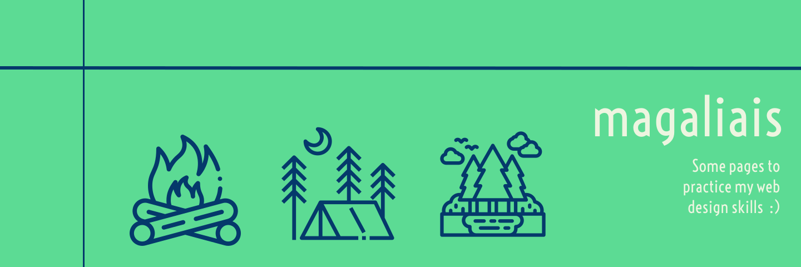

<h1 align="center">
    front-end pages
</h1>

<h2 align="center">
    
</h2>

 

---

&nbsp;&nbsp;&nbsp;&nbsp;In this repository, you will find some of the pages I built to practice HTML, CSS, Sass and JavaScript. The pages are only views and often don't have any functionalities.

&nbsp;&nbsp;&nbsp;&nbsp;Also, I'm learning how to use Figma (which is where I designed the header of this readme). This document is yet to be finished.

 

---
By <a href="https://www.github.com/magaliais" target="_blank">magaliais</a>.